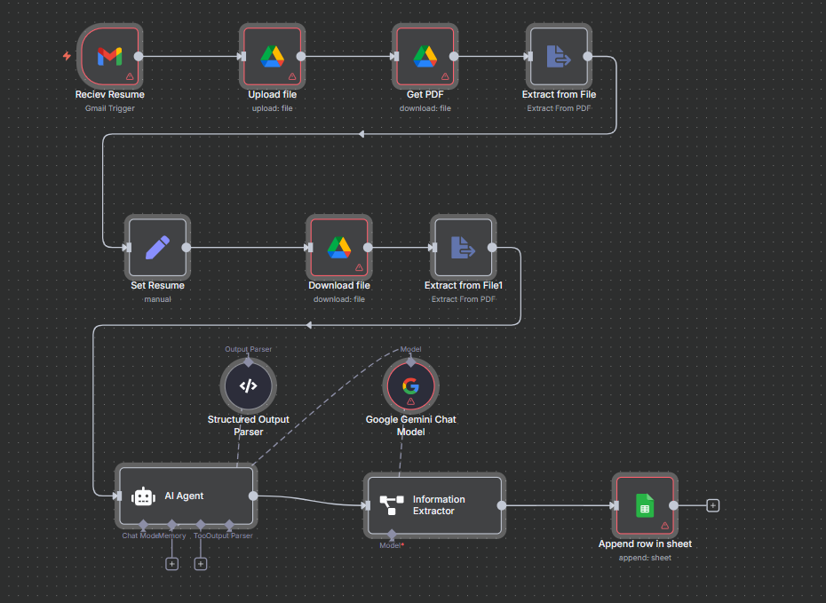

# 🤖 AI Agent-Powered HR Assistant for Dynamic Resume Management & Shortlisting

## 📌 Overview
This project implements an **AI-powered HR assistant** using **n8n automation** and **Google Gemini** to streamline the process of **resume collection, analysis, and shortlisting**.  
It automatically receives resumes via Gmail, stores them in Google Drive, extracts text, compares the content with a given job description, and generates a **structured evaluation** of candidates — including **strengths, weaknesses, risk/reward factors, and overall fit score**.

---

## 🚀 Features
- **Automated Resume Collection** from Gmail.
- **Google Drive Integration** for secure storage.
- **PDF Text Extraction** for both resumes and job descriptions.
- **AI-Powered Candidate Analysis** using Google Gemini.
- **Structured Evaluation Output**:
  - Candidate Strengths
  - Candidate Weaknesses
  - Risk Factor
  - Reward Factor
  - Overall Fit Rating
  - Justification for Rating
- **Google Sheets Logging** for centralized tracking.

---

## 🛠️ Tech Stack
- **n8n** – Workflow automation
- **Google Gmail API** – Resume intake
- **Google Drive API** – File storage & retrieval
- **Google Gemini API** – AI candidate analysis
- **Google Sheets API** – Storing structured results
- **PDF Parser** – Text extraction

---

## 📂 Workflow Diagram
Below is the high-level **n8n flow diagram** for the project:



---

## 🔄 Workflow Steps
1. **Receive Resume** – Gmail trigger captures incoming emails with resume attachments.
2. **Upload File** – Store resume in Google Drive.
3. **Extract Resume Content** – Parse PDF into text.
4. **Retrieve Job Description** – Download & extract job description file.
5. **AI Analysis** – Compare resume with job description using Google Gemini.
6. **Information Extraction** – Identify candidate name & email.
7. **Append to Google Sheet** – Store all details for HR review.

---

## 📎 Setup Instructions
### 1️⃣ Clone Repository
```bash
git clone https://github.com/yourusername/hr-ai-agent.git
cd hr-ai-agent
```
### 2️⃣ Import n8n Workflow
- Open n8n.
- Import the provided .json file (hr ai agent.json).
### 3️⃣ Configure Credentials
- Gmail OAuth2
- Google Drive OAuth2
- Google Sheets OAuth2
- Google Gemini API Key

### 4️⃣ Deploy & Test
- Send a test email with a resume attachment to the connected Gmail account.
- Check Google Sheets for automated analysis results.

🧑‍💻 Author
[N.SURYA PRAKASH REDDY]
🔗 www.linkedin.com/in/nsprakashreddy
📧 suryareddynallimilli@gmail.com

